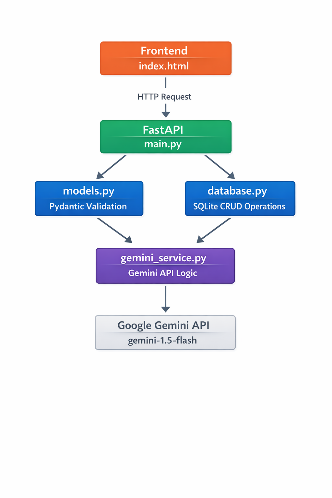
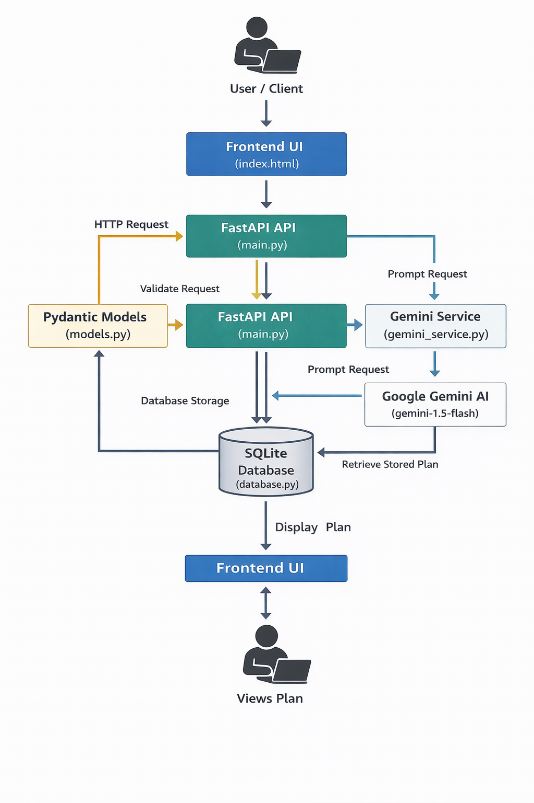

# FitBuddy – AI Fitness Plan Generator

FitBuddy is a web-based application that uses Google Gemini AI to generate
personalized 7-day workout plans and nutrition tips based on user fitness goals.

---

## 🤖 AI Model Used
**Model:** `gemini-1.5-flash`

### Why gemini-1.5-flash?
| Criteria         | Details                              |
|------------------|--------------------------------------|
| Speed            | Very fast responses                  |
| Cost             | Free tier available on Google AI     |
| Text Generation  | Excellent for structured plans       |
| Context Window   | 1M tokens — handles long plans       |
| Stability        | Production-ready and well supported  |

---

## ⚙️ Project Structure
```
fitbuddy/
├── backend/
│   ├── main.py            # FastAPI app and all routes
│   ├── gemini_service.py  # Gemini AI prompt and API logic
│   ├── database.py        # SQLite setup and CRUD helpers
│   └── models.py          # Pydantic request/response models
├── frontend/
│   └── index.html         # Complete UI
├── requirements.txt       # All dependencies
├── .env.example           # Template for environment variables
├── .gitignore             # Files to exclude from Git
├── test_gemini.py         # Quick test to verify Gemini setup
└── README.md              # Project documentation
```
### Architecture Diagram


### Workflow Diagram


---

## 🚀 Setup Instructions

### 1. Clone the Repository
```bash
git clone https://github.com/YOUR_USERNAME/fitbuddy.git
cd fitbuddy
```

### 2. Create Virtual Environment
```bash
python -m venv venv

# Windows
venv\Scripts\activate

# Mac/Linux
source venv/bin/activate
```

### 3. Install Dependencies
```bash
pip install -r requirements.txt
```

### 4. Get Your Gemini API Key
- Go to https://aistudio.google.com
- Sign in with YOUR personal Google account
- Click **Get API Key** → **Create new key**
- Copy the key

### 5. Create Your .env File
```bash
# Copy the example file
copy .env.example .env      # Windows
cp .env.example .env        # Mac/Linux
```
Then open `.env` and replace `your_own_gemini_api_key_here` with your actual key.

### 6. Test Your Setup
```bash
python test_gemini.py
```
If you see a fitness tip printed — your setup is complete ✅

---

## 👥 Team Notes
- **Never share your `.env` file or API key**
- Each developer must generate their own free API key
- The `.env` file is listed in `.gitignore` so it will never be pushed to GitHub
